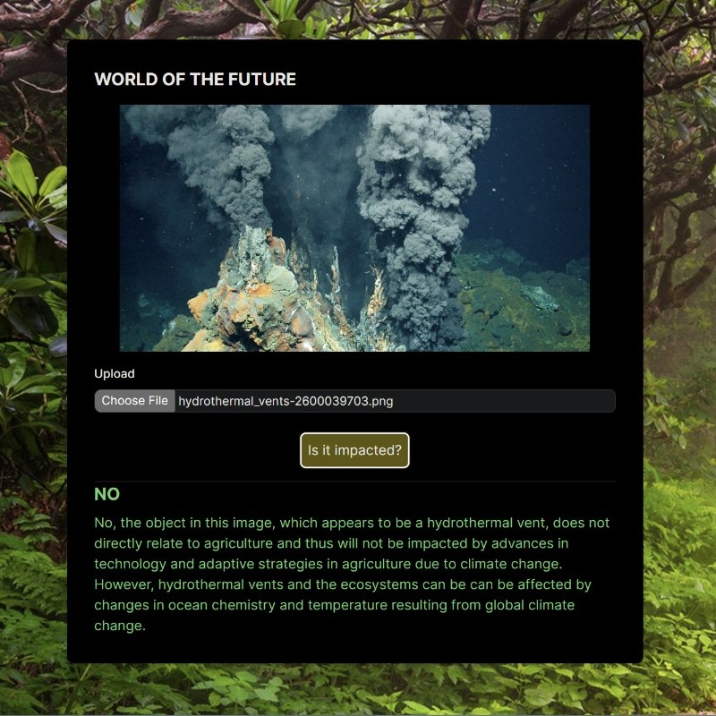

# Environment GPT

## What it is
With so much access to information nowadays, it's easy to get lost or overwhelmed. We wanted to streamline and personalize climate communication by helping you answer a simple question: **How will climate change affect me?** 
That's why we created Environment GPT, a quick and easy way to see which of your favorite things will be irreversibly impacted by the climate crisis, powered by GPT-4.
## How to use

<<<<<<< HEAD

=======
>>>>>>> dace2e98a7e8f425ae1386733e499725c817c5a1
First, in `app\api\analyzeImage\route.ts`, replace `YOUR-KEY-HERE` with your own **gpt-4-vision-preview** API key

Run the development server:

```bash
npm run dev
# or
yarn dev
# or
pnpm dev
# or
bun dev
```

Open [http://localhost:3000](http://localhost:3000) with your browser to see the result.

Upload or paste an image of what you want to investigate, and click the button to see if it will be impacted.

<p float="left">
  
   
</p>

<p float="left">
   
  
</p>

<p float="left">
  
   
</p>
